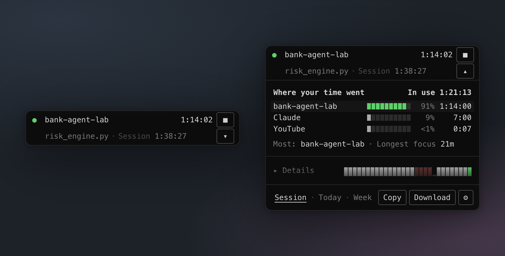
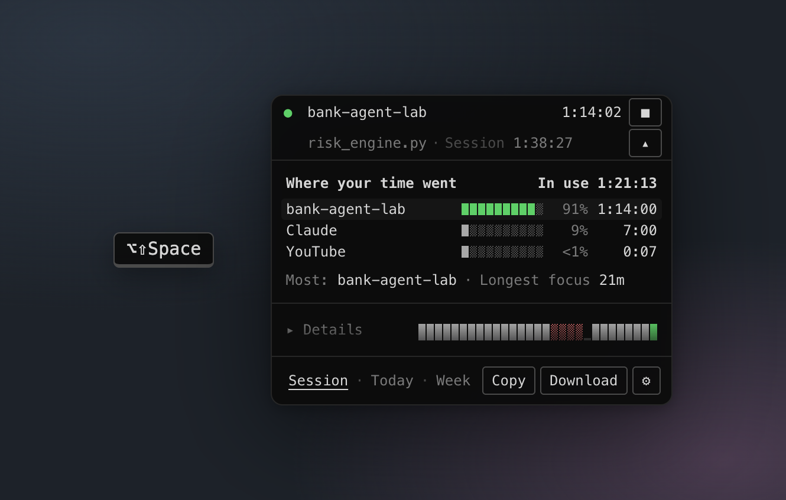
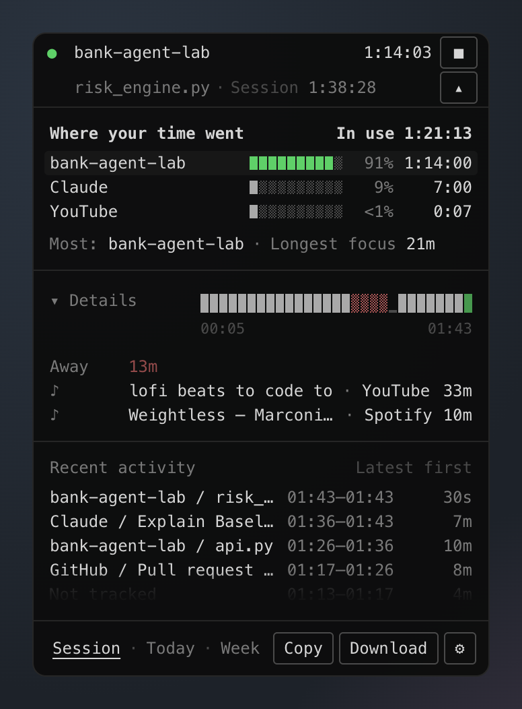
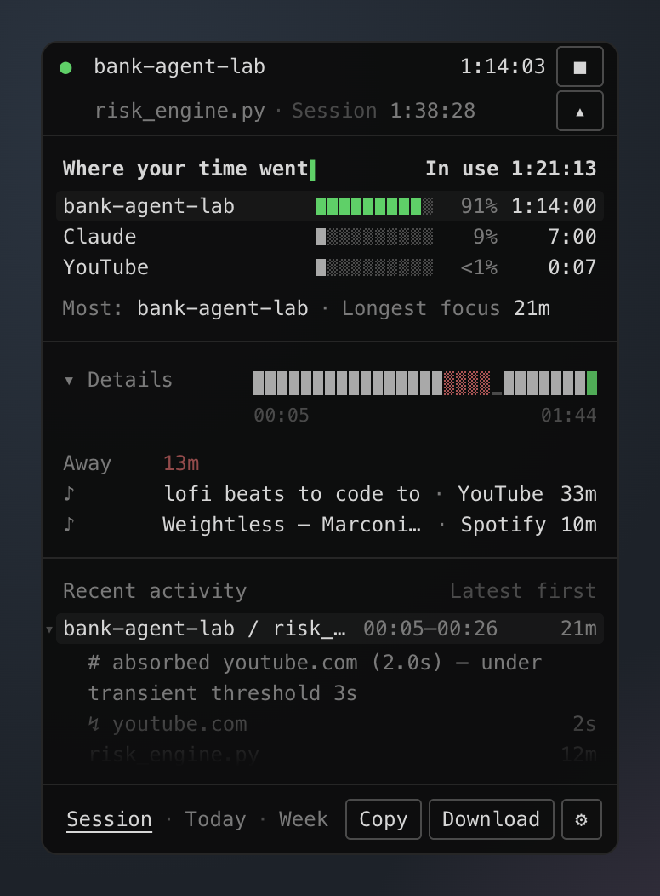
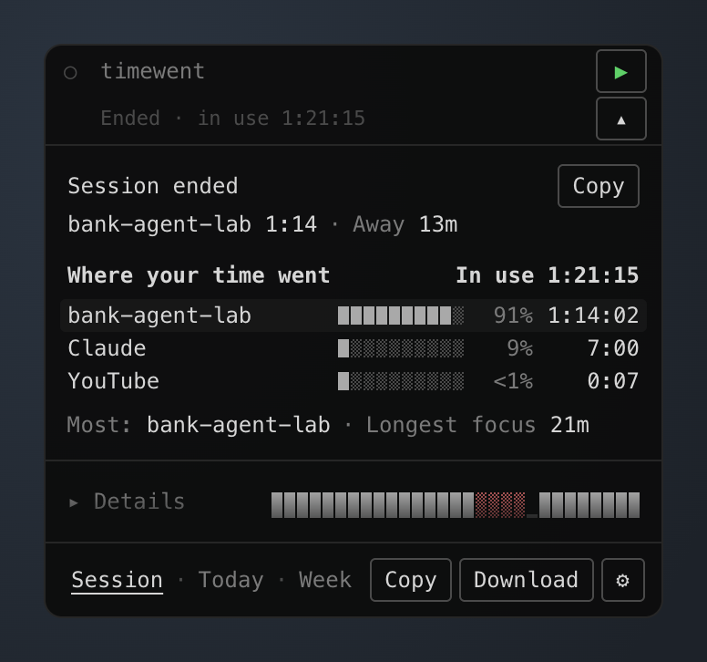
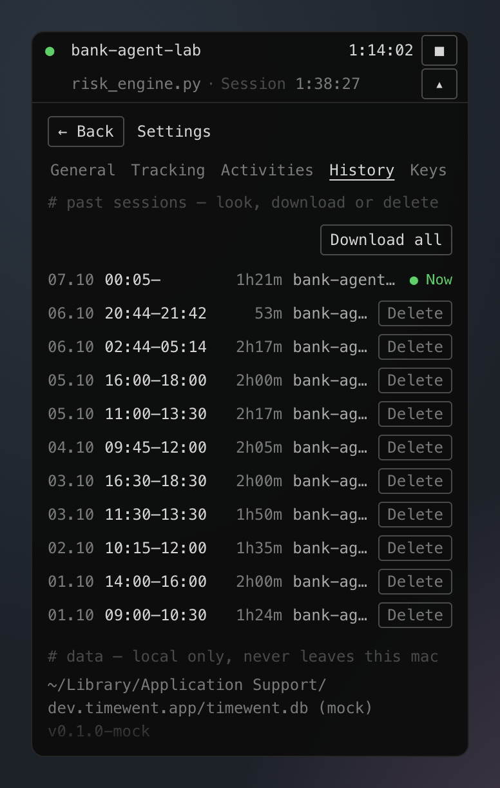

<h1 align="center">timewent</h1>
<p align="center"><b>see where your time went.</b></p>
<p align="center">
A tiny, local-first time tracker for macOS.<br>
No timers, no tasks, no labels. Work as usual, then look.
</p>

<p align="center">
  
</p>

---

## Install

Open **Terminal**, paste this line, and press Enter:

```sh
curl -fsSL https://raw.githubusercontent.com/GDenizKaratas/timewent/main/install.sh | sh
```

That's it. You don't need any developer tools. It downloads the latest version (works on Apple
Silicon and Intel Macs, macOS 12+), puts timewent in **Applications** and opens it.

**First launch:** press **▶** in the pill, then allow **Accessibility** when macOS asks (that's
how timewent sees file and page names). Peek any time with **`⌥⇧Space`**.

**Update:** run the same line again. **Uninstall:** quit timewent, then

```sh
rm -rf /Applications/timewent.app ~/Library/LaunchAgents/timewent.plist
rm -rf ~/Library/Application\ Support/dev.timewent.app   # also deletes your history
```

<details>
<summary>Prefer to download it yourself?</summary>

1. Get `timewent-macos-universal.zip` from [Releases](https://github.com/GDenizKaratas/timewent/releases/latest),
   open it, and drag `timewent.app` into Applications.
2. timewent isn't notarized by Apple yet, so macOS blocks the first launch. Open
   *System Settings → Privacy & Security*, scroll down and click **Open Anyway**. You only do this once.
</details>

## What it's for

You sit down for "an hour of work". Afterwards you can't say where that hour went. timewent
answers that question **without asking anything from you**: which project, which apps and sites,
how long you stayed focused, and when you walked away.

## Why it feels effortless

- **You never start a task.** timewent opens with your Mac. Turn on *Auto start* and it begins on
  your first keystroke.
- **Your keys, your hands.** One global key to look and the same key to get back to work. Your
  cursor lands back where you were.
- **It understands context.** Research in ChatGPT or docs *between* two coding blocks counts toward
  that project. A 2-second YouTube glance doesn't break your focus. Reading isn't "away", a video
  call isn't idle, and timewent never counts the time you spend looking at timewent.
- **One answer by default.** The panel shows *where your time went*, and everything else is one
  click away under **▸ Details**.

## Lightweight by design

| | |
|---|---|
| **App size** | ~6 MB |
| **CPU while tracking** | ~0.4% |
| **CPU when stopped** | 0% (no background work) |
| **Memory** | ~20 MB |
| **Network** | none, ever |
| **Keystrokes, screenshots, clipboard, page contents** | never read |

Built with Tauri 2, Rust and vanilla TypeScript: no Electron, no framework, no telemetry.

## Keyboard first

| Key | |
|---|---|
| **`⌥⇧Space`** | **peek** from anywhere; press again to return to your app |
| `space` | start / stop |
| `esc` | collapse, then hide (tracking continues) |
| `1` `2` `3` | session · today · week |
| `⌘E` | download the report |
| `⌘,` | settings |
| `?` | every shortcut |

<p align="center">
  
</p>

## More, when you want it

<table>
  <tr>
    <td width="50%"></td>
    <td width="50%"></td>
  </tr>
  <tr>
    <td><b>▸ Details</b> shows away time, the music that played behind your work (♪, never counted as work), and every switch.</td>
    <td><b>Every number explains itself.</b> Click any block to see why it was counted that way.</td>
  </tr>
  <tr>
    <td width="50%"></td>
    <td width="50%"></td>
  </tr>
  <tr>
    <td><b>Stop = receipt.</b> End a session and see where it went.</td>
    <td><b>History.</b> Open, download or delete any past session.</td>
  </tr>
</table>

**Your own names:** group apps and sites into an activity (`Coding = VS Code + iTerm2`).
**English and Türkçe:** the language follows your Mac.

## Hand it to any LLM

**Copy** or **Download** gives you a compact, self-describing JSON report of a session, a day,
a week, or everything. It is built to be read by a language model: local times, whole seconds,
the story in blocks, and short visits summarised instead of listed. Paste it in and ask
*"what did I actually do today?"* Example: [docs/export-example.json](docs/export-example.json)

## How it decides

| You | timewent |
|---|---|
| type, click, move, or scroll | **active** |
| no input for 45s (reading, thinking) | **reading**, still in use |
| no input for 3 min, or screen locked | **away**, backdated to when you left |
| video playing or on a call | never away |
| switch for under 3s | folded into what you were doing |
| Spotlight, Dock, timewent itself | never an activity |
| Mac asleep or off | not tracked |

Raw samples are never modified. Every view is recomputed from them, so changing a threshold
re-derives your whole history. All the rules: [docs/DESIGN.md](docs/DESIGN.md).

## Privacy

timewent reads **which app is in front, its window title, and the browser tab's URL**, plus *how
many seconds ago* you last used the keyboard or mouse. There is no keyboard hook, so it cannot
know what you typed. Data lives only in `~/Library/Application Support/dev.timewent.app/`.

macOS asks once for **Accessibility** (window titles) and **Automation** (browser URLs,
Spotify/Music track names).

## Build from source

You need, once: Xcode Command Line Tools (`xcode-select --install`),
[Rust](https://rustup.rs) and [Node.js](https://nodejs.org) 20+.
After installing Rust, **open a new terminal** so `cargo` is on your PATH. `npm run build`
checks this first and tells you what's missing.

```sh
git clone https://github.com/GDenizKaratas/timewent.git && cd timewent
npm install          # also installs the ui
npm run build        # first build takes a few minutes
open target/release/bundle/macos/timewent.app
```

Move it to `/Applications` if you like. Development: `npm run dev` · tests: `cargo test --workspace && npm test`.

Locally built apps are ad-hoc signed, so macOS forgets the Accessibility grant after a rebuild. If
file names disappear, toggle timewent off and on in *System Settings → Privacy & Security →
Accessibility*.

## Roadmap

**Done**
- ✅ Automatic tracking: app, window, tab, and idle state, with no timers
- ✅ Active / reading / away detection, backdated, with lock and sleep awareness
- ✅ Video and meetings never counted as away
- ✅ Projects from editor titles, with research (AI, docs, GitHub) credited to the project
- ✅ Your own activities (group apps and sites under one name)
- ✅ Kinds of time (code, ai, docs, media, comms…) and ♪ background listening
- ✅ Every number explains itself
- ✅ Pill + one-answer panel, peek key (`⌥⇧Space`), keyboard-first
- ✅ Stop = receipt, history (open / download / delete)
- ✅ Auto start, open at login
- ✅ Compact, LLM-ready JSON report: copy or download
- ✅ English and Türkçe

**Next**
- ⬜ **Explain with a local LLM:** a three-sentence summary of your day from LM Studio or Ollama,
  on your Mac and never in the cloud
- ⬜ **Yesterday** at a glance
- ⬜ Long-term history: compact old raw data automatically and keep the summaries
- ⬜ Signed and notarized release, installable with Homebrew
- ⬜ Optional VS Code and browser extensions for even finer detail
- ⬜ Windows and Linux

## License

MIT. See [LICENSE](LICENSE).
